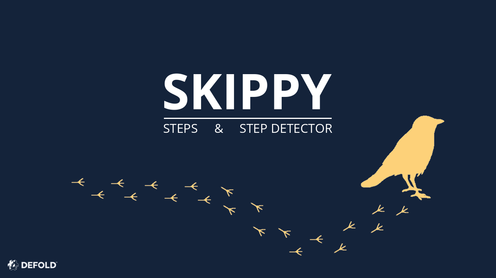

# Skippy

This is a steps tracking extension for the [Defold game engine](http://www.defold.com).

## Sensors supported

- TYPE_STEP_COUNTER
- TYPE_STEP_DETECTOR

## System requirements

The extension currently only supports Android.

## Installation

You can use the Skippy extension in your own project by adding this project as a [Defold library dependency](http://www.defold.com/manuals/libraries/). Open your game.project file and in the dependencies field under project add:

[Defold Skippy](https://github.com/NaakkaDev/defold-skippy/archive/master.zip)

```
https://github.com/NaakkaDev/defold-skippy/archive/master.zip
```

## Quick API Reference

```lua
skippy.start()
skippy.stop()
skippy.get_steps()          -- TYPE_STEP_COUNTER
skippy.get_steps_detector() -- TYPE_STEP_DETECTOR
```

## Example

```lua
function init(self)
  -- Start the sensor listeners.
  skippy.start()
  -- Get the steps after a tiny delay.
  timer.delay(0.2, false, function()
    print("Steps since phone was turned on:", skippy.get_steps())
  end
end

function final(self)
 -- Stop the sensor listeners.
 -- Probably not needed here (final()) since the stop will be called in C++ side
 -- when the app shuts down.
 skippy.stop()
end
```

Check out the [example.script](./example/example.script).

If you're going to android bundle this for a test walk, remember to allow the Physical Activity permission in the app info -> Permissions.

## Contributing

Pull requests are always welcome!

## License

MIT
